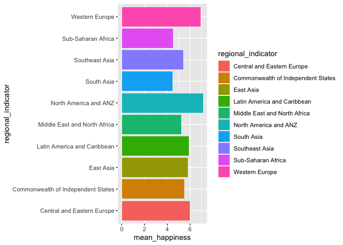
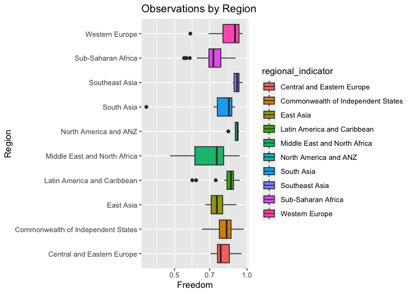

# BIS15W24 

#Mohit & Tian


# Introduction

We will be using data published on Kaggle. The data comes from a spreadsheet with information. The data contains 7 csv files from 2015 to 2022 ranking happiness across different regions and countries in the world. 

In our project we will focus on the 2021 csv file.


# The World Happiness Report
The data is collected by The World Happiness Report which surveys bliss. The report gains worldwide acknowledgment as organizations and governments utilize reports such as this one to influence their policy-making decisions. It is a national average of the responses to the main life evaluation question asked in the Gallup World Poll, which uses the Cantril Ladder.


The reports survey the state of bliss within the world nowadays and appear how the modern science of bliss clarifies variation between the regions of the world. 


The 2021 data that we use in our project utilize a Happiness score which is explained by GDP per capita, Healthy Life Expectancy, Social Support, Freedom to make life choices, etc. 


Our project aims to show the data in a more presentable fashion by including ranges and certain values of countries. 


# Cleaning the data

## Names: 
Janitor work

## Removing variables: 
All variables remained but were not utilized on graphs.

## Joins 
None of the other csv files were joined with 2021 as the column names were not similar and R was not allowing us to. 

## Happiest Country: Finland

## Highest GDP Country: Luxembourg


## Sources

https://www.kaggle.com/datasets/mathurinache/world-happiness-report/data?select=2021.csv

Presentation


```r
library("tidyverse")
```

```
## ── Attaching core tidyverse packages ──────────────────────── tidyverse 2.0.0 ──
## ✔ dplyr     1.1.4     ✔ readr     2.1.4
## ✔ forcats   1.0.0     ✔ stringr   1.5.1
## ✔ ggplot2   3.4.4     ✔ tibble    3.2.1
## ✔ lubridate 1.9.3     ✔ tidyr     1.3.0
## ✔ purrr     1.0.2     
## ── Conflicts ────────────────────────────────────────── tidyverse_conflicts() ──
## ✖ dplyr::filter() masks stats::filter()
## ✖ dplyr::lag()    masks stats::lag()
## ℹ Use the conflicted package (<http://conflicted.r-lib.org/>) to force all conflicts to become errors
```

```r
library("janitor")
```

```
## 
## Attaching package: 'janitor'
## 
## The following objects are masked from 'package:stats':
## 
##     chisq.test, fisher.test
```

```r
library("lubridate")
```


```r
happy <- read_csv("dataa/2021.csv") %>% clean_names()
```

```
## Rows: 149 Columns: 20
## ── Column specification ────────────────────────────────────────────────────────
## Delimiter: ","
## chr  (2): Country name, Regional indicator
## dbl (18): Ladder score, Standard error of ladder score, upperwhisker, lowerw...
## 
## ℹ Use `spec()` to retrieve the full column specification for this data.
## ℹ Specify the column types or set `show_col_types = FALSE` to quiet this message.
```

```r
happy
```

```
## # A tibble: 149 × 20
##    country_name regional_indicator    ladder_score standard_error_of_ladder_sc…¹
##    <chr>        <chr>                        <dbl>                         <dbl>
##  1 Finland      Western Europe                7.84                         0.032
##  2 Denmark      Western Europe                7.62                         0.035
##  3 Switzerland  Western Europe                7.57                         0.036
##  4 Iceland      Western Europe                7.55                         0.059
##  5 Netherlands  Western Europe                7.46                         0.027
##  6 Norway       Western Europe                7.39                         0.035
##  7 Sweden       Western Europe                7.36                         0.036
##  8 Luxembourg   Western Europe                7.32                         0.037
##  9 New Zealand  North America and ANZ         7.28                         0.04 
## 10 Austria      Western Europe                7.27                         0.036
## # ℹ 139 more rows
## # ℹ abbreviated name: ¹​standard_error_of_ladder_score
## # ℹ 16 more variables: upperwhisker <dbl>, lowerwhisker <dbl>,
## #   logged_gdp_per_capita <dbl>, social_support <dbl>,
## #   healthy_life_expectancy <dbl>, freedom_to_make_life_choices <dbl>,
## #   generosity <dbl>, perceptions_of_corruption <dbl>,
## #   ladder_score_in_dystopia <dbl>, explained_by_log_gdp_per_capita <dbl>, …
```


### ANY NA's


```r
anyNA(happy)
```

```
## [1] FALSE
```

### Number of countries per region


```r
table(happy$regional_indicator)
```

```
## 
##         Central and Eastern Europe Commonwealth of Independent States 
##                                 17                                 12 
##                          East Asia        Latin America and Caribbean 
##                                  6                                 20 
##       Middle East and North Africa              North America and ANZ 
##                                 17                                  4 
##                         South Asia                     Southeast Asia 
##                                  7                                  9 
##                 Sub-Saharan Africa                     Western Europe 
##                                 36                                 21
```
Total of 149 countries with 10 regions!


```r
happy %>%
  group_by(regional_indicator) %>%
  summarize(mean_happiness=mean(ladder_score, na.rm=T)) %>%
  ggplot(aes(x=regional_indicator, y=mean_happiness, fill=regional_indicator))+ 
  geom_col()+
  coord_flip()
```

<!-- -->

Western Europe, North America and ANZ, and Central and Eastern Europe rank the highest in ladder scores (happiness)!

Sub-Saharan Africa, South Asia, and Middle East and North Africa rank the lowest in ladder scores (happiness)!


```r
happy %>%
  group_by(regional_indicator) %>%
  summarize(mean_gdp=mean(logged_gdp_per_capita, na.rm=T)) %>%
  ggplot(aes(x=regional_indicator, y=mean_gdp, fill=regional_indicator))+ 
  geom_col()+
  coord_flip()
```

<!-- -->

Western Europe, North America and ANZ, and East Asia rank the highest in logged GDP per capita (economy)!

Sub-Saharan Africa, South Asia, and Latin America and Carribean rank the lowest in logged GDP per capita (economy)!


```r
happy %>%
  group_by(regional_indicator) %>%
  summarize(mean_life_expectancy=mean(healthy_life_expectancy, na.rm=T)) %>%
  ggplot(aes(x=regional_indicator, y=mean_life_expectancy, fill=regional_indicator))+ 
  geom_col()+
  coord_flip()
```

<!-- -->

Western Europe, North America and ANZ, and East Asia rank the highest in mean healthy life expectancy!

Sub-Saharan Africa, South Asia, and Commonwealth of Independent States rank the lowest in mean healthy life expectancy!


```r
happy %>%
  group_by(regional_indicator) %>%
  summarize(mean_socialsupport=mean(social_support, na.rm=T)) %>%
  ggplot(aes(x=regional_indicator, y=mean_socialsupport, fill=regional_indicator))+ 
  geom_col()+
  coord_flip()
```

<!-- -->

Western Europe, North America and ANZ, and Central and Eastern Europe rank the highest in mean social support!

Sub-Saharan Africa, South Asia, and Middle East and North Africa rank the lowest in mean  mean social support!

Highest Ladder Score 


```r
happy %>%
  select(country_name, ladder_score) %>%
  arrange(desc(ladder_score))
```

```
## # A tibble: 149 × 2
##    country_name ladder_score
##    <chr>               <dbl>
##  1 Finland              7.84
##  2 Denmark              7.62
##  3 Switzerland          7.57
##  4 Iceland              7.55
##  5 Netherlands          7.46
##  6 Norway               7.39
##  7 Sweden               7.36
##  8 Luxembourg           7.32
##  9 New Zealand          7.28
## 10 Austria              7.27
## # ℹ 139 more rows
```

Lowest Ladder Score 


```r
happy %>%
  select(country_name, ladder_score) %>%
  arrange(ladder_score)
```

```
## # A tibble: 149 × 2
##    country_name ladder_score
##    <chr>               <dbl>
##  1 Afghanistan          2.52
##  2 Zimbabwe             3.14
##  3 Rwanda               3.42
##  4 Botswana             3.47
##  5 Lesotho              3.51
##  6 Malawi               3.6 
##  7 Haiti                3.62
##  8 Tanzania             3.62
##  9 Yemen                3.66
## 10 Burundi              3.78
## # ℹ 139 more rows
```

Top 5 Countries for Life Expectancy


```r
happy %>%
  select(country_name, healthy_life_expectancy) %>%
  arrange(desc(healthy_life_expectancy))
```

```
## # A tibble: 149 × 2
##    country_name              healthy_life_expectancy
##    <chr>                                       <dbl>
##  1 Singapore                                    77.0
##  2 Hong Kong S.A.R. of China                    76.8
##  3 Japan                                        75.1
##  4 Spain                                        74.7
##  5 Switzerland                                  74.4
##  6 France                                       74  
##  7 Australia                                    73.9
##  8 South Korea                                  73.9
##  9 Cyprus                                       73.9
## 10 North Cyprus                                 73.9
## # ℹ 139 more rows
```

Lowest 5 Countries for Life Expectancy


```r
happy %>%
  select(country_name, healthy_life_expectancy) %>%
  arrange(healthy_life_expectancy)
```

```
## # A tibble: 149 × 2
##    country_name healthy_life_expectancy
##    <chr>                          <dbl>
##  1 Chad                            48.5
##  2 Lesotho                         48.7
##  3 Nigeria                         50.1
##  4 Ivory Coast                     50.1
##  5 Swaziland                       50.8
##  6 Sierra Leone                    51.7
##  7 Mali                            52.0
##  8 Afghanistan                     52.5
##  9 Burundi                         53.4
## 10 Cameroon                        53.5
## # ℹ 139 more rows
```


Highest/Lowest 5 Countries for logged_gdp_per_capita


```r
happy %>%
  select(country_name, logged_gdp_per_capita) %>%
  arrange(desc(logged_gdp_per_capita))
```

```
## # A tibble: 149 × 2
##    country_name              logged_gdp_per_capita
##    <chr>                                     <dbl>
##  1 Luxembourg                                 11.6
##  2 Singapore                                  11.5
##  3 Ireland                                    11.3
##  4 Switzerland                                11.1
##  5 United Arab Emirates                       11.1
##  6 Norway                                     11.1
##  7 United States                              11.0
##  8 Hong Kong S.A.R. of China                  11  
##  9 Denmark                                    10.9
## 10 Netherlands                                10.9
## # ℹ 139 more rows
```


```r
happy %>%
  select(country_name,logged_gdp_per_capita) %>%
  arrange((logged_gdp_per_capita))
```

```
## # A tibble: 149 × 2
##    country_name logged_gdp_per_capita
##    <chr>                        <dbl>
##  1 Burundi                       6.64
##  2 Malawi                        6.96
##  3 Niger                         7.10
##  4 Mozambique                    7.16
##  5 Liberia                       7.29
##  6 Togo                          7.36
##  7 Chad                          7.36
##  8 Madagascar                    7.40
##  9 Sierra Leone                  7.43
## 10 Haiti                         7.48
## # ℹ 139 more rows
```


Range of Freedom to Make Life Choices by Region


```r
happy %>% 
  ggplot(aes(x=regional_indicator, y=freedom_to_make_life_choices, fill=regional_indicator))+
  geom_boxplot()+
  coord_flip()+
  scale_y_log10()+
  labs(title="Observations by Region",
       x="Region",
       y="Freedom")
```

<!-- -->


```r
happy %>%
  filter(country_name=="Finland") %>%
  select(ladder_score, logged_gdp_per_capita, healthy_life_expectancy, social_support)
```

```
## # A tibble: 1 × 4
##   ladder_score logged_gdp_per_capita healthy_life_expectancy social_support
##          <dbl>                 <dbl>                   <dbl>          <dbl>
## 1         7.84                  10.8                      72          0.954
```


```r
happy %>%
  filter(country_name=="United States") %>%
  select(ladder_score, logged_gdp_per_capita, healthy_life_expectancy, social_support) 
```

```
## # A tibble: 1 × 4
##   ladder_score logged_gdp_per_capita healthy_life_expectancy social_support
##          <dbl>                 <dbl>                   <dbl>          <dbl>
## 1         6.95                  11.0                    68.2           0.92
```


```r
happy %>%
  filter(country_name=="Afghanistan") %>%
  select(ladder_score, logged_gdp_per_capita, healthy_life_expectancy, social_support) 
```

```
## # A tibble: 1 × 4
##   ladder_score logged_gdp_per_capita healthy_life_expectancy social_support
##          <dbl>                 <dbl>                   <dbl>          <dbl>
## 1         2.52                  7.70                    52.5          0.463
```


These data sets are used to show that not one individual variable is used to assess the countries happiness based off of their ladder score, for instance the U.S. has a higher logged GDP per capita but ranks lower than Finland in the ladder score, life expectancy, and social support! 


