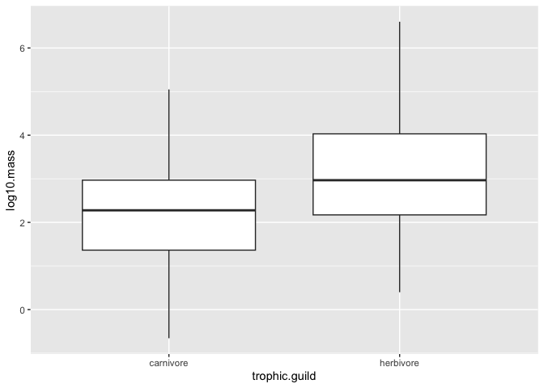

## Learning Goals
*At the end of this exercise, you will be able to:*    
1. Produce boxplots using `ggplot.`  
2. Customize labels on axes using `labs` and `themes`.  
3. Use `color`, `fill`, and `group` to customize plots and improve overall aesthetics.  

##Resources  
- [ggplot2 cheatsheet](https://www.rstudio.com/wp-content/uploads/2015/03/ggplot2-cheatsheet.pdf)  
- [`ggplot` themes](https://ggplot2.tidyverse.org/reference/ggtheme.html)  
- [Rebecca Barter `ggplot` Tutorial](http://www.rebeccabarter.com/blog/2017-11-17-ggplot2_tutorial/)  

## Load the libraries

```r
library(tidyverse)
library(skimr)
library(janitor)
library(palmerpenguins)
library(here)
```

## Review
Now that you have been introduced to `ggplot`, let's practice a few more plot types. Remember that plots are built in layers: **plot= data + geom_ + aesthetics**. We have to specify each of these in order for a plot to be produced. If you get stuck, it is often helpful to stop and make a quick sketch of what you want or expect to see on a piece of scratch paper.  

Let's review using the `penguins` data. First, get an idea of the structure: Are the data tidy? Are there NA's? Are the variables discrete, categorical, or continuous?

```r
penguins
```

```
## # A tibble: 344 × 8
##    species island    bill_length_mm bill_depth_mm flipper_length_mm body_mass_g
##    <fct>   <fct>              <dbl>         <dbl>             <int>       <int>
##  1 Adelie  Torgersen           39.1          18.7               181        3750
##  2 Adelie  Torgersen           39.5          17.4               186        3800
##  3 Adelie  Torgersen           40.3          18                 195        3250
##  4 Adelie  Torgersen           NA            NA                  NA          NA
##  5 Adelie  Torgersen           36.7          19.3               193        3450
##  6 Adelie  Torgersen           39.3          20.6               190        3650
##  7 Adelie  Torgersen           38.9          17.8               181        3625
##  8 Adelie  Torgersen           39.2          19.6               195        4675
##  9 Adelie  Torgersen           34.1          18.1               193        3475
## 10 Adelie  Torgersen           42            20.2               190        4250
## # ℹ 334 more rows
## # ℹ 2 more variables: sex <fct>, year <int>
```

In a previous lab, we asked how many penguins were measured on each island.

```r
penguins %>% 
  count(island)
```

```
## # A tibble: 3 × 2
##   island        n
##   <fct>     <int>
## 1 Biscoe      168
## 2 Dream       124
## 3 Torgersen    52
```

Make this output more visual by adding a plot...

```r
penguins %>% 
  count(island) %>% 
  ggplot(aes(x=island, y=n))+
  geom_col()
```

<!-- -->

## Practice
1. What if we wanted a plot that showed the number of measured penguins for each species?

```r
penguins %>% 
  count(species)
```

```
## # A tibble: 3 × 2
##   species       n
##   <fct>     <int>
## 1 Adelie      152
## 2 Chinstrap    68
## 3 Gentoo      124
```


```r
penguins %>% 
  count(species) %>% 
  ggplot(aes(x=species, y=n))+
  geom_col()
```

<!-- -->

2. How about average bill length by sex?

```r
penguins %>% 
  filter(sex!="NA") %>% 
  group_by(sex) %>% 
  summarise(ave_bill_length=mean(bill_length_mm))
```

```
## # A tibble: 2 × 2
##   sex    ave_bill_length
##   <fct>            <dbl>
## 1 female            42.1
## 2 male              45.9
```


```r
penguins %>% 
  filter(sex!="NA") %>% 
  group_by(sex) %>% 
  summarise(ave_bill_length=mean(bill_length_mm)) %>% 
  ggplot(aes(x=sex, y=ave_bill_length)) +
  geom_col()
```

<!-- -->

## Box Plots
For the next series of examples, we will use the `homerange` data.  **Database of vertebrate home range sizes.**   

Reference: Tamburello N, Cote IM, Dulvy NK (2015) Energy and the scaling of animal space use. The American Naturalist 186(2):196-211. http://dx.doi.org/10.1086/682070.  
Data: http://datadryad.org/resource/doi:10.5061/dryad.q5j65/1  


```r
homerange <- read_csv("data/Tamburelloetal_HomeRangeDatabase.csv")
homerange
```

```
## # A tibble: 569 × 24
##    taxon        common.name class order family genus species primarymethod N    
##    <chr>        <chr>       <chr> <chr> <chr>  <chr> <chr>   <chr>         <chr>
##  1 lake fishes  american e… acti… angu… angui… angu… rostra… telemetry     16   
##  2 river fishes blacktail … acti… cypr… catos… moxo… poecil… mark-recaptu… <NA> 
##  3 river fishes central st… acti… cypr… cypri… camp… anomal… mark-recaptu… 20   
##  4 river fishes rosyside d… acti… cypr… cypri… clin… fundul… mark-recaptu… 26   
##  5 river fishes longnose d… acti… cypr… cypri… rhin… catara… mark-recaptu… 17   
##  6 river fishes muskellunge acti… esoc… esoci… esox  masqui… telemetry     5    
##  7 marine fish… pollack     acti… gadi… gadid… poll… pollac… telemetry     2    
##  8 marine fish… saithe      acti… gadi… gadid… poll… virens  telemetry     2    
##  9 marine fish… lined surg… acti… perc… acant… acan… lineat… direct obser… <NA> 
## 10 marine fish… orangespin… acti… perc… acant… naso  litura… telemetry     8    
## # ℹ 559 more rows
## # ℹ 15 more variables: mean.mass.g <dbl>, log10.mass <dbl>,
## #   alternative.mass.reference <chr>, mean.hra.m2 <dbl>, log10.hra <dbl>,
## #   hra.reference <chr>, realm <chr>, thermoregulation <chr>, locomotion <chr>,
## #   trophic.guild <chr>, dimension <dbl>, preymass <dbl>, log10.preymass <dbl>,
## #   PPMR <dbl>, prey.size.reference <chr>
```

Boxplots help us visualize a range of values. So, on the x-axis we typically have something categorical and the y-axis is the range. In the case below, we are plotting `log10.mass` by taxonomic class in the `homerange` data. `geom_boxplot()` is the geom type for a standard box plot. The center line in each box represents the median, not the mean.

Let's look at the variable `log10.mass` grouped by taxonomic class.

```r
homerange %>% 
  group_by(class) %>% 
  summarize(min_log10.mass=min(log10.mass),
            max_log10.mass=max(log10.mass),
            median_log10.mass=median(log10.mass))
```

```
## # A tibble: 4 × 4
##   class          min_log10.mass max_log10.mass median_log10.mass
##   <chr>                   <dbl>          <dbl>             <dbl>
## 1 actinopterygii         -0.658           3.55              2.08
## 2 aves                    0.712           4.95              1.82
## 3 mammalia                0.620           6.60              3.33
## 4 reptilia                0.539           4.03              2.51
```


```r
homerange %>% 
  ggplot(aes(x = class, y = log10.mass)) +
  geom_boxplot()
```

<!-- -->

## Practice
1. There are more herbivores than carnivores in the homerange data, but how do their masses compare? Make a summary and boxplot that compares their masses. Use `log10.mass`.

```r
names(homerange)
```

```
##  [1] "taxon"                      "common.name"               
##  [3] "class"                      "order"                     
##  [5] "family"                     "genus"                     
##  [7] "species"                    "primarymethod"             
##  [9] "N"                          "mean.mass.g"               
## [11] "log10.mass"                 "alternative.mass.reference"
## [13] "mean.hra.m2"                "log10.hra"                 
## [15] "hra.reference"              "realm"                     
## [17] "thermoregulation"           "locomotion"                
## [19] "trophic.guild"              "dimension"                 
## [21] "preymass"                   "log10.preymass"            
## [23] "PPMR"                       "prey.size.reference"
```


```r
homerange %>% 
  group_by(trophic.guild) %>% 
  summarize(mean_log10.mass=mean(log10.mass))
```

```
## # A tibble: 2 × 2
##   trophic.guild mean_log10.mass
##   <chr>                   <dbl>
## 1 carnivore                2.24
## 2 herbivore                3.13
```


```r
homerange %>% 
  ggplot(aes(x=trophic.guild, y=log10.mass))+
  geom_boxplot()
```

<!-- -->

2. Have a closer look at carnivorous mammals. Summarize the range of log10.mass by family.

```r
homerange %>% 
  filter(class=="mammalia" & trophic.guild=="carnivore") %>% 
  group_by(family) %>% 
  summarize(mean_mass=mean(log10.mass))
```

```
## # A tibble: 18 × 2
##    family          mean_mass
##    <chr>               <dbl>
##  1 canidae             3.73 
##  2 chrysochloridae     2.00 
##  3 cricetidae          1.39 
##  4 dasyuridae          2.32 
##  5 didelphidae         1.38 
##  6 erinaceidae         2.69 
##  7 eupleridae          3.98 
##  8 felidae             4.16 
##  9 herpestidae         3.16 
## 10 hyanidae            4    
## 11 macroscelididae     2.27 
## 12 mustelidae          3.08 
## 13 peramelidae         2.74 
## 14 soricidae           0.882
## 15 tachyglossidae      2.41 
## 16 talpidae            1.90 
## 17 ursidae             4.99 
## 18 viverridae          3.49
```

3. Now use a boxplot to visualize the range of log10.mass by family of mammalian carnivore.

```r
homerange %>% 
  filter(class=="mammalia" & trophic.guild=="carnivore") %>% 
  select(family, trophic.guild, log10.mass) %>% 
  ggplot(aes(x=family, y=log10.mass))+
  geom_boxplot()+
  coord_flip()
```

<!-- -->


```r
glimpse(homerange)
```

```
## Rows: 569
## Columns: 24
## $ taxon                      <chr> "lake fishes", "river fishes", "river fishe…
## $ common.name                <chr> "american eel", "blacktail redhorse", "cent…
## $ class                      <chr> "actinopterygii", "actinopterygii", "actino…
## $ order                      <chr> "anguilliformes", "cypriniformes", "cyprini…
## $ family                     <chr> "anguillidae", "catostomidae", "cyprinidae"…
## $ genus                      <chr> "anguilla", "moxostoma", "campostoma", "cli…
## $ species                    <chr> "rostrata", "poecilura", "anomalum", "fundu…
## $ primarymethod              <chr> "telemetry", "mark-recapture", "mark-recapt…
## $ N                          <chr> "16", NA, "20", "26", "17", "5", "2", "2", …
## $ mean.mass.g                <dbl> 887.00, 562.00, 34.00, 4.00, 4.00, 3525.00,…
## $ log10.mass                 <dbl> 2.9479236, 2.7497363, 1.5314789, 0.6020600,…
## $ alternative.mass.reference <chr> NA, NA, NA, NA, NA, NA, NA, NA, NA, NA, NA,…
## $ mean.hra.m2                <dbl> 282750.00, 282.10, 116.11, 125.50, 87.10, 3…
## $ log10.hra                  <dbl> 5.4514026, 2.4504031, 2.0648696, 2.0986437,…
## $ hra.reference              <chr> "Minns, C. K. 1995. Allometry of home range…
## $ realm                      <chr> "aquatic", "aquatic", "aquatic", "aquatic",…
## $ thermoregulation           <chr> "ectotherm", "ectotherm", "ectotherm", "ect…
## $ locomotion                 <chr> "swimming", "swimming", "swimming", "swimmi…
## $ trophic.guild              <chr> "carnivore", "carnivore", "carnivore", "car…
## $ dimension                  <dbl> 3, 2, 2, 2, 2, 2, 2, 2, 2, 2, 2, 2, 2, 3, 3…
## $ preymass                   <dbl> NA, NA, NA, NA, NA, NA, 1.39, NA, NA, NA, N…
## $ log10.preymass             <dbl> NA, NA, NA, NA, NA, NA, 0.1430148, NA, NA, …
## $ PPMR                       <dbl> NA, NA, NA, NA, NA, NA, 530, NA, NA, NA, NA…
## $ prey.size.reference        <chr> NA, NA, NA, NA, NA, NA, "Brose U, et al. 20…
```


## Wrap-up  
Please review the learning goals and be sure to use the code here as a reference when completing the homework.    
-->[Home](https://jmledford3115.github.io/datascibiol/)
