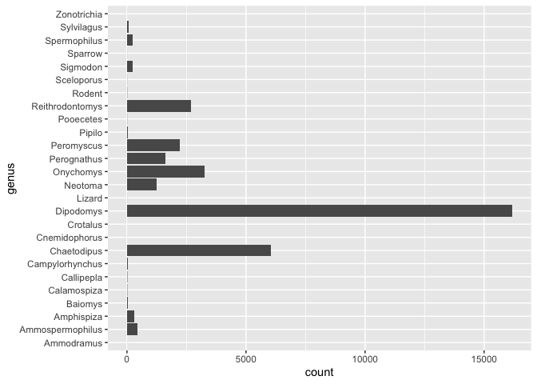
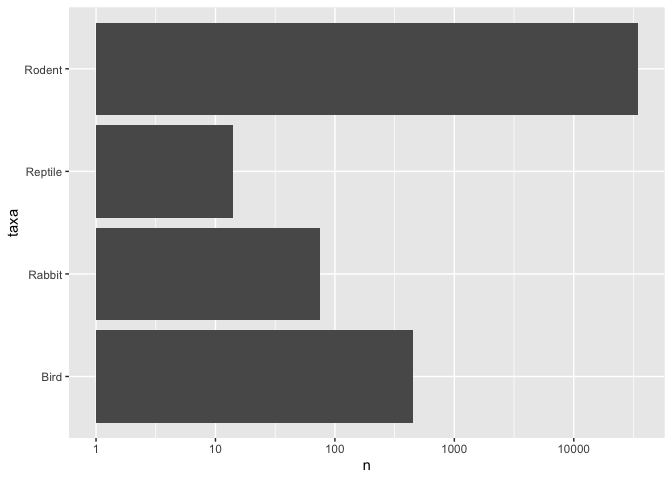
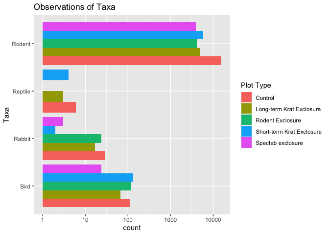
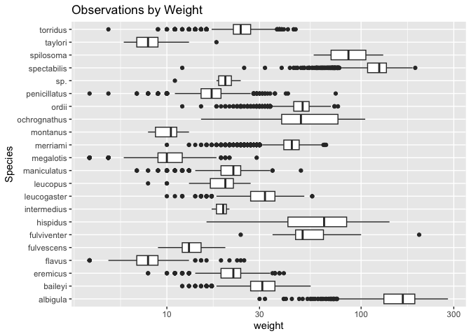
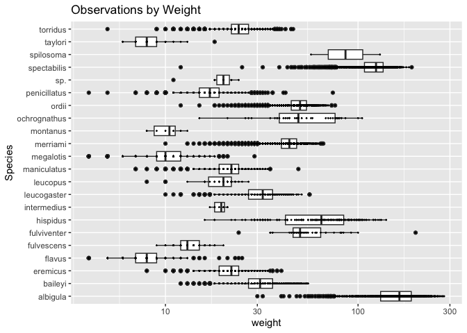
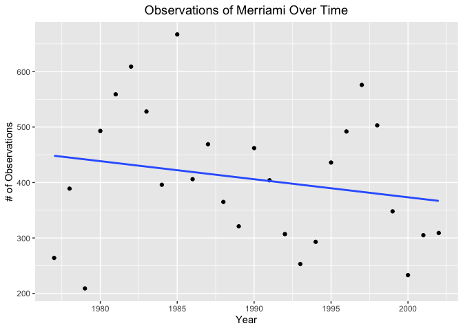
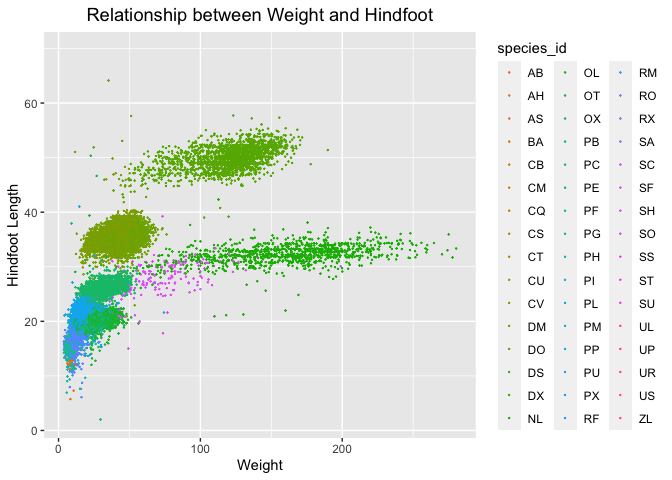
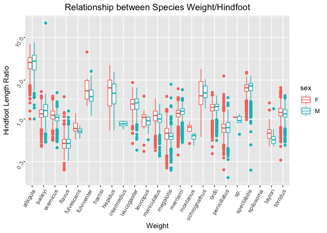
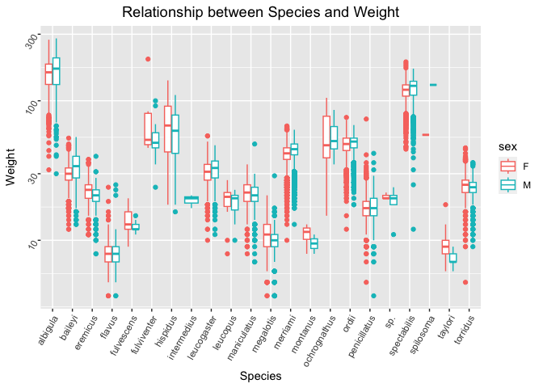

## Instructions
Answer the following questions and complete the exercises in RMarkdown. Please embed all of your code and push your final work to your repository. Your final lab report should be organized, clean, and run free from errors. Remember, you must remove the `#` for the included code chunks to run. Be sure to add your name to the author header above. For any included plots, make sure they are clearly labeled. You are free to use any plot type that you feel best communicates the results of your analysis.  

Make sure to use the formatting conventions of RMarkdown to make your report neat and clean!  

## Load the libraries

```r
library(tidyverse)
library(janitor)
library(naniar)
```

## Desert Ecology
For this assignment, we are going to use a modified data set on [desert ecology](http://esapubs.org/archive/ecol/E090/118/). The data are from: S. K. Morgan Ernest, Thomas J. Valone, and James H. Brown. 2009. Long-term monitoring and experimental manipulation of a Chihuahuan Desert ecosystem near Portal, Arizona, USA. Ecology 90:1708.

```r
deserts <- read_csv("data/surveys_complete.csv") %>% clean_names()
```

```
## Rows: 34786 Columns: 13
## ── Column specification ────────────────────────────────────────────────────────
## Delimiter: ","
## chr (6): species_id, sex, genus, species, taxa, plot_type
## dbl (7): record_id, month, day, year, plot_id, hindfoot_length, weight
## 
## ℹ Use `spec()` to retrieve the full column specification for this data.
## ℹ Specify the column types or set `show_col_types = FALSE` to quiet this message.
```

1. Use the function(s) of your choice to get an idea of its structure, including how NA's are treated. Are the data tidy?  


```r
deserts
```

```
## # A tibble: 34,786 × 13
##    record_id month   day  year plot_id species_id sex   hindfoot_length weight
##        <dbl> <dbl> <dbl> <dbl>   <dbl> <chr>      <chr>           <dbl>  <dbl>
##  1         1     7    16  1977       2 NL         M                  32     NA
##  2         2     7    16  1977       3 NL         M                  33     NA
##  3         3     7    16  1977       2 DM         F                  37     NA
##  4         4     7    16  1977       7 DM         M                  36     NA
##  5         5     7    16  1977       3 DM         M                  35     NA
##  6         6     7    16  1977       1 PF         M                  14     NA
##  7         7     7    16  1977       2 PE         F                  NA     NA
##  8         8     7    16  1977       1 DM         M                  37     NA
##  9         9     7    16  1977       1 DM         F                  34     NA
## 10        10     7    16  1977       6 PF         F                  20     NA
## # ℹ 34,776 more rows
## # ℹ 4 more variables: genus <chr>, species <chr>, taxa <chr>, plot_type <chr>
```


```r
glimpse(deserts)
```

```
## Rows: 34,786
## Columns: 13
## $ record_id       <dbl> 1, 2, 3, 4, 5, 6, 7, 8, 9, 10, 11, 12, 13, 14, 15, 16,…
## $ month           <dbl> 7, 7, 7, 7, 7, 7, 7, 7, 7, 7, 7, 7, 7, 7, 7, 7, 7, 7, …
## $ day             <dbl> 16, 16, 16, 16, 16, 16, 16, 16, 16, 16, 16, 16, 16, 16…
## $ year            <dbl> 1977, 1977, 1977, 1977, 1977, 1977, 1977, 1977, 1977, …
## $ plot_id         <dbl> 2, 3, 2, 7, 3, 1, 2, 1, 1, 6, 5, 7, 3, 8, 6, 4, 3, 2, …
## $ species_id      <chr> "NL", "NL", "DM", "DM", "DM", "PF", "PE", "DM", "DM", …
## $ sex             <chr> "M", "M", "F", "M", "M", "M", "F", "M", "F", "F", "F",…
## $ hindfoot_length <dbl> 32, 33, 37, 36, 35, 14, NA, 37, 34, 20, 53, 38, 35, NA…
## $ weight          <dbl> NA, NA, NA, NA, NA, NA, NA, NA, NA, NA, NA, NA, NA, NA…
## $ genus           <chr> "Neotoma", "Neotoma", "Dipodomys", "Dipodomys", "Dipod…
## $ species         <chr> "albigula", "albigula", "merriami", "merriami", "merri…
## $ taxa            <chr> "Rodent", "Rodent", "Rodent", "Rodent", "Rodent", "Rod…
## $ plot_type       <chr> "Control", "Long-term Krat Exclosure", "Control", "Rod…
```

```r
names(deserts)
```

```
##  [1] "record_id"       "month"           "day"             "year"           
##  [5] "plot_id"         "species_id"      "sex"             "hindfoot_length"
##  [9] "weight"          "genus"           "species"         "taxa"           
## [13] "plot_type"
```

There are NA's and the data is tidy.

2. How many genera and species are represented in the data? What are the total number of observations? Which species is most/ least frequently sampled in the study?


```r
table(deserts$genus)
```

```
## 
##       Ammodramus Ammospermophilus       Amphispiza          Baiomys 
##                2              437              303               46 
##      Calamospiza       Callipepla  Campylorhynchus      Chaetodipus 
##               13               16               50             6029 
##    Cnemidophorus         Crotalus        Dipodomys           Lizard 
##                2                2            16167                4 
##          Neotoma        Onychomys      Perognathus       Peromyscus 
##             1252             3267             1629             2234 
##           Pipilo        Pooecetes  Reithrodontomys           Rodent 
##               52                8             2694               10 
##       Sceloporus         Sigmodon          Sparrow     Spermophilus 
##                6              233                4              249 
##       Sylvilagus      Zonotrichia 
##               75                2
```


```r
table(deserts$species)
```

```
## 
##        albigula       audubonii         baileyi       bilineata brunneicapillus 
##            1252              75            2891             303              50 
##       chlorurus          clarki        eremicus          flavus      fulvescens 
##              39               1            1299            1597              75 
##     fulviventer          fuscus       gramineus         harrisi        hispidus 
##              43               5               8             437             179 
##     intermedius     leucogaster      leucophrys        leucopus     maniculatus 
##               9            1006               2              36             899 
##       megalotis     melanocorys        merriami        montanus    ochrognathus 
##            2609              13           10596               8              43 
##           ordii    penicillatus      savannarum      scutalatus             sp. 
##            3027            3123               2               1              86 
##     spectabilis       spilosoma        squamata         taylori    tereticaudus 
##            2504             248              16              46               1 
##          tigris        torridus       undulatus       uniparens         viridis 
##               1            2249               5               1               1
```


```r
summary(deserts$genus)
```

```
##    Length     Class      Mode 
##     34786 character character
```


```r
deserts %>% 
  count(genus, species) %>%
   arrange(n)
```

```
## # A tibble: 48 × 3
##    genus           species          n
##    <chr>           <chr>        <int>
##  1 Cnemidophorus   tigris           1
##  2 Cnemidophorus   uniparens        1
##  3 Crotalus        scutalatus       1
##  4 Crotalus        viridis          1
##  5 Sceloporus      clarki           1
##  6 Spermophilus    tereticaudus     1
##  7 Ammodramus      savannarum       2
##  8 Reithrodontomys sp.              2
##  9 Zonotrichia     leucophrys       2
## 10 Lizard          sp.              4
## # ℹ 38 more rows
```

The species least frequently sampled in this study is tigris, uniparens, scutalatus, viridis, clarki, and tereticaudus.


```r
deserts %>% 
  count(genus, species) %>%
   arrange(desc(n))
```

```
## # A tibble: 48 × 3
##    genus           species          n
##    <chr>           <chr>        <int>
##  1 Dipodomys       merriami     10596
##  2 Chaetodipus     penicillatus  3123
##  3 Dipodomys       ordii         3027
##  4 Chaetodipus     baileyi       2891
##  5 Reithrodontomys megalotis     2609
##  6 Dipodomys       spectabilis   2504
##  7 Onychomys       torridus      2249
##  8 Perognathus     flavus        1597
##  9 Peromyscus      eremicus      1299
## 10 Neotoma         albigula      1252
## # ℹ 38 more rows
```

The species most frequently sampled in this study is merriami.


```r
deserts %>% 
  ggplot(aes(x=genus)) + 
  geom_bar()+
  coord_flip()
```

<!-- -->


```r
deserts %>% 
  count(taxa) %>% 
  ggplot(aes(x=taxa, y=n))+
  geom_col()+
  coord_flip()+
  scale_y_log10()
```

<!-- -->


3. What is the proportion of taxa included in this study? Show a table and plot that reflects this count.


```r
table(deserts$taxa)
```

```
## 
##    Bird  Rabbit Reptile  Rodent 
##     450      75      14   34247
```


```r
deserts %>% 
  ggplot(aes(x=taxa)) + 
  geom_bar()+
  coord_flip()+
  scale_y_log10()
```

<!-- -->


4. For the taxa included in the study, use the fill option to show the proportion of individuals sampled by `plot_type.`


```r
deserts %>% 
  ggplot(aes(x=taxa, fill=plot_type))+
  geom_bar(position="dodge")+
  coord_flip()+
  scale_y_log10()+
  labs(title="Observations of Taxa",
       x="Taxa",
       fill="Plot Type")
```

<!-- -->


5. What is the range of weight for each species included in the study? Remove any observations of weight that are NA so they do not show up in the plot.


```r
deserts %>% 
  filter(weight!="NA") %>% #removes NA's
  ggplot(aes(x=species, y=weight))+
  geom_boxplot()+
  coord_flip()+
  scale_y_log10()+
  labs(title="Observations by Weight",
       x="Species",
       fill="Weight")
```

<!-- -->


6. Add another layer to your answer from #5 using `geom_point` to get an idea of how many measurements were taken for each species.


```r
deserts %>% 
  filter(weight!="NA") %>% #removes NA's
  ggplot(aes(x=species, y=weight))+
  geom_boxplot()+
  geom_point(size=0.25)+
  coord_flip()+
  scale_y_log10()+
  labs(title="Observations by Weight",
       x="Species",
       fill="Weight")
```

<!-- -->

7. [Dipodomys merriami](https://en.wikipedia.org/wiki/Merriam's_kangaroo_rat) is the most frequently sampled animal in the study. How have the number of observations of this species changed over the years included in the study?


```r
deserts %>%
  filter(species=="merriami") %>%
  group_by(year) %>%
  count(species) %>%
  ggplot(aes(x=year, y=n))+
  geom_point()+
  geom_smooth(method = lm, se=F)+
  labs(title="Observations of Merriami Over Time", x="Year", y="# of Observations")+
  theme(plot.title=element_text(size=rel(1.25), hjust=0.5))
```

```
## `geom_smooth()` using formula = 'y ~ x'
```

<!-- -->
Gone down over the years.


8. What is the relationship between `weight` and `hindfoot` length? Consider whether or not over plotting is an issue.


```r
deserts %>%
  ggplot(aes(x=weight, y=hindfoot_length))+
  geom_jitter(na.rm=T, size= 0.1, aes(color=species_id))+
  labs(title="Relationship between Weight and Hindfoot", x="Weight", y="Hindfoot Length")+
  theme(plot.title=element_text(size=rel(1.25), hjust=0.5))
```

<!-- -->


9. Which two species have, on average, the highest weight? Once you have identified them, make a new column that is a ratio of `weight` to `hindfoot_length`. Make a plot that shows the range of this new ratio and fill by sex.


```r
deserts %>%
  group_by(species) %>%
  summarize(mean_weight=mean(weight, na.rm=T)) %>%
  arrange(desc(mean_weight))
```

```
## # A tibble: 40 × 2
##    species      mean_weight
##    <chr>              <dbl>
##  1 albigula           159. 
##  2 spectabilis        120. 
##  3 spilosoma           93.5
##  4 hispidus            65.6
##  5 fulviventer         58.9
##  6 ochrognathus        55.4
##  7 ordii               48.9
##  8 merriami            43.2
##  9 baileyi             31.7
## 10 leucogaster         31.6
## # ℹ 30 more rows
```

```r
  labs(title="Relationship between Weight and Hindfoot", x="Weight", y="Hindfoot Length")+
  theme(plot.title=element_text(size=rel(1.25), hjust=0.5))
```

```
## NULL
```


```r
deserts_2 <- deserts%>%
  mutate(weight_to_hindfoot_length=weight/hindfoot_length)
```


```r
deserts_2 %>%
  filter(sex!="NA", species!="NA") %>%
  ggplot(aes(x=species, y=weight_to_hindfoot_length))+
  geom_boxplot(aes(color=sex), na.rm=T)+
  scale_y_log10()+
  labs(title="Relationship between Species Weight/Hindfoot", x="Weight", y="Hindfoot Length Ratio")+
  theme(axis.text=element_text(angle=60, hjust=1), plot.title = element_text(size=rel(1.25), hjust=0.5))
```

<!-- -->


10. Make one plot of your choice! Make sure to include at least two of the aesthetics options you have learned.


```r
deserts_2 %>%
  filter(sex!="NA", species!="NA", weight!="NA") %>%
  ggplot(aes(x=species, y=weight))+
  geom_boxplot(aes(color=sex), na.rm=T)+
  scale_y_log10()+
  labs(title="Relationship between Species and Weight", x="Species", y="Weight")+
  theme(axis.text=element_text(angle=60, hjust=1), plot.title = element_text(size=rel(1.25), hjust=0.5))
```

<!-- -->


## Push your final code to GitHub!
Please be sure that you check the `keep md` file in the knit preferences. 
